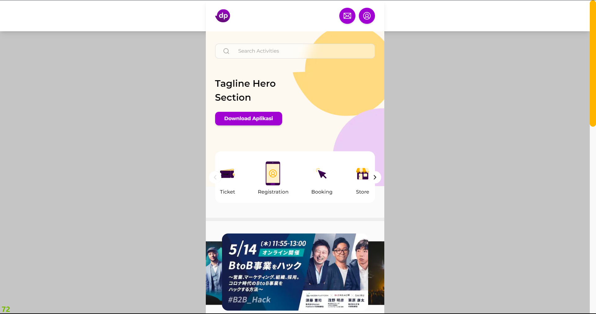

<p align="center">
  <a href="" rel="noopener">
 </a>
</p>

<h1  align="center">DEPUBLIC PROJECT</h1>

<div align="center">

[]()
[](https://github.com/amieow/depublic-amieow/issues)
[](https://github.com/amieow/depublic-amieow/pulls)

</div>

<h3 align="center"> 
    <br> 
CODING CHALLENGE PROJECT BASED SMKDEV Community - FRONT END
</h3>

---

## 📝 Table of Contents

- [About](#about)
- [Folder Structure](#folder_structure)
- [Environment Variables](#environment)
- [Usage](#usage)
- [Deployment](#deployment)
- [Built Using](#built_using)
- [Authors](#authors)
- [Acknowledgments](#acknowledgement)

## 🧐 About <a id="about" name = "about"></a>

This platform is a marketplace for buying and selling concert or event tickets.
It offers various categories of needs. Users who register on this application
can act as buyers. In this case, users are expected to easily find concert
schedules that suit their needs and pay for tickets online. Additionally, the
website is expected to provide accurate and up-to-date information about ongoing
events.

## 📁 Folder Structure <a id="folder_structure" name = "about"></a>

1. **app** (main application router) :
   - This folder contains the main application router.
2. **components** :
   - **atoms** :
     - This folder contains the smallest building blocks of the application,
       such as buttons, inputs, and labels.
   - **organisme** :
     - This folder contains more complex components that are composed of atoms,
       such as forms, cards, and modals.
3. **contents** :
   - This folder contains the content of the application, such as text, images,
     and videos.
4. **context** :
   - This folder contains the context providers and hooks used to manage the
     state of the application.
5. **lib** :
   - This folder contains utility functions and classes used throughout the
     application.
6. **utils** :
   - This folder contains utility functions and classes that are specific to the
     application.

## 💲 Environment Variables <a id="environment" name = "environment"></a>

#### to add environment variables you must doint this step :

1. create the `.env.local` file on the root folder
2. add this text inside the file

   ```
   NEXTAUTH_SECRET=YOUR_NEXTAUTH_SECRET
   GOOGLE_CLIENT_ID=YOUR_GOOGLE_CLIENT_ID
   GOOGLE_CLIENT_SECRET=YOUR_GOOGLE_CLIENT_SECRET
   NEXTAUTH_URL=YOUR_NEXTAUTH_URL
   ```

   - `NEXTAUTH_SECRET` : A secret string, which can be generated using base64
     encoding.
   - `GOOGLE_CLIENT_ID` : Your Google Client ID.

   - `GOOGLE_CLIENT_SECRET` : Your Google Client Secret.
   - `NEXTAUTH_URL` : The URL of your website. For development, use
     `http://localhost:3000/`.

#### some blog maybe you need it :

- [How to get Google Client Id and Google Client Secret](https://developers.google.com/identity/gsi/web/guides/get-google-api-clientid)

This process allows you to securely store and access sensitive information
required by your application. Remember not to share or expose these values
publicly to maintain the security of your application.

## 🎈 Usage <a id="usage" name="usage"></a>

### Running the Application Locally

To run your Next.js application locally, follow these steps:

1. Install the required packages by running `npm install` in your project
   directory.
2. add the environment variable
3. Build the application by running `npm run build`.
4. Start the development server by running `npm run dev`.
5. Visit `http://localhost:3000` in your web browser to view the application.

For more information on running a Next.js application locally, check out the
official documentation.

## 🚀 Deployment <a id="deployment" name = "deployment"></a>

The fastest way to deploy a Next.js application is by using Vercel. Vercel
automatically detects Next.js and runs `next build` when you push your code to a
Git repository. It also optimizes the build output for you, including:

- Persisting cached assets across deployments if unchanged
- Immutable deployments with a unique URL for every commit

To deploy your Next.js application to Vercel, follow these steps:

1. Create an account on Vercel.
2. Connect your Git repository to Vercel.
3. Configure your deployment settings, such as environment variables and custom
   domains.
4. Deploy your application.

For more information on deploying a Next.js application, check out the
[official documentation](https://nextjs.org/docs).

## ⛏️ Built Using <a id="built_using" name = "built_using"></a>

### 📚 Dependencies

#### 🎨 UI Libraries

- [`@radix-ui/react-alert-dialog`](https://www.npmjs.com/package/@radix-ui/react-alert-dialog)
  version `^1.0.5`: A React component library for creating accessible alert
  dialogs.
- [`@radix-ui/react-checkbox`](https://www.npmjs.com/package/@radix-ui/react-checkbox)
  version `^1.0.4`: Radix UI library component for creating customizable
  checkboxes in React.
- [`@radix-ui/react-label`](https://www.npmjs.com/package/@radix-ui/react-label)
  version `^2.0.2`: Radix UI library component for creating accessible labels in
  React.
- [`@radix-ui/react-radio-group`](https://www.npmjs.com/package/@radix-ui/react-radio-group)
  version `^1.1.3`: Radix UI library component for creating radio groups with
  React.
- [`@radix-ui/react-select`](https://www.npmjs.com/package/@radix-ui/react-select)
  version `^2.0.0`: Radix UI library component for creating accessible select
  menus in React.
- [`@radix-ui/react-separator`](https://www.npmjs.com/package/@radix-ui/react-separator)
  version `^1.0.3`: Radix UI library component for creating separators in React.
- [`@radix-ui/react-slot`](https://www.npmjs.com/package/@radix-ui/react-slot)
  version `^1.0.2`: Radix UI library component for creating slotted content in
  React.
- [`lucide-react`](https://www.npmjs.com/package/lucide-react) version
  `^0.288.0`: A library for adding SVG icons to your React applications.
- [`swiper`](https://www.npmjs.com/package/swiper) version `^10.3.1`: A modern
  mobile touch slider with hardware-accelerated transitions.

#### 📝 Form & Validation Libraries

- [`@hookform/resolvers`](https://www.npmjs.com/package/@hookform/resolvers)
  version `^3.3.2`: Resolvers for React Hook Form, providing validation
  functionality.
- [`react-hook-form`](https://www.npmjs.com/package/react-hook-form) version
  `^7.47.0`: A performant and flexible library for managing forms in React.
- [`zod`](https://www.npmjs.com/package/zod) version `^3.22.4`: A
  TypeScript-first schema declaration and validation library.

#### 🎛️ State Management Libraries

- [`zustand`](https://www.npmjs.com/package/zustand) version `^4.4.3`: A small,
  fast, and scalable state management library for React.

#### 🚀 Frameworks

- [`next`](https://www.npmjs.com/package/next) version `13.5.5`: A React
  framework for building server-rendered React applications.
- [`react`](https://www.npmjs.com/package/react) version `^18`: A JavaScript
  library for building user interfaces.
- [`react-dom`](https://www.npmjs.com/package/react-dom) version `^18`: React
  package for working with the DOM.

#### 🛠️ Build Tools

- [`babel-plugin-inline-react-svg`](https://www.npmjs.com/package/babel-plugin-inline-react-svg)
  version `^2.0.2`: Babel plugin for inlining SVGs as React components.
- [`eslint`](https://www.npmjs.com/package/eslint) version `^8`: A pluggable
  JavaScript linter.
- [`eslint-config-next`](https://www.npmjs.com/package/eslint-config-next)
  version `13.5.5`: ESLint configuration for Next.js projects.
- [`next-pwa`](https://www.npmjs.com/package/next-pwa) version `^5.6.0`: A
  plugin to add Progressive Web App (PWA) support to Next.js applications.
- [`postcss`](https://www.npmjs.com/package/postcss) version `^8`: A tool for
  transforming styles with JavaScript plugins.
- [`sharp`](https://www.npmjs.com/package/sharp) version `^0.32.6`: A
  high-performance image processing library.
- [`tailwind-merge`](https://www.npmjs.com/package/tailwind-merge) version
  `^1.14.0`: A utility for merging Tailwind CSS classes.
- [`tailwindcss`](https://www.npmjs.com/package/tailwindcss) version `^3`: A
  utility-first CSS framework.
- [`tailwindcss-animate`](https://www.npmjs.com/package/tailwindcss-animate)
  version `^1.0.7`: An extension for adding animations to Tailwind CSS.
- [`typescript`](https://www.npmjs.com/package/typescript) version `^5`: A
  superset of JavaScript that adds static types.

### 🔒 Authentication

- [`next-auth`](https://www.npmjs.com/package/next-auth) version `^4.24.4`: An
  authentication library for Next.js applications.

#### 🧰 Utilities

- [`class-variance-authority`](https://www.npmjs.com/package/class-variance-authority)
  version `^0.7.0`: A utility for managing class variance in JavaScript.
- [`clsx`](https://www.npmjs.com/package/clsx) version `^2.0.0`: A tiny utility
  for conditionally joining class names together.

### 🔧 Dev Dependencies

The project uses several dev dependencies including:

- `@svgr/webpack` version `^8.1.0`
- `autoprefixer` version `^10`

Please note that the versions of the dependencies are subject to change as the
project evolves.

## ✍️ Authors <a id="authors" name = "authors"></a>

### Owner :

[](https://github.com/amieow)

### Contributors :

## 🎉 Acknowledgements <a id="acknowledgement" name = "acknowledgement"></a>

- Hat tip to anyone whose code was used.
- **References**
  - **Chat - gpt** : An AI model that generates the documentation .
  - **Bard - ai** : An AI model that generates the documentation .
  - [**Next-js Docs**](https://nextjs.org/docs) : The official documentation of
    Next.js, a React framework for building web applications.
